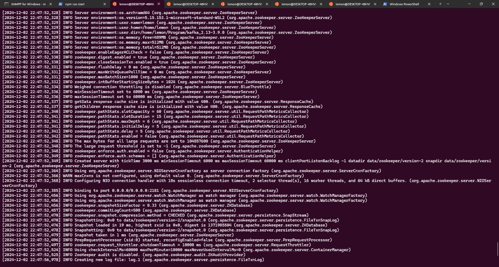
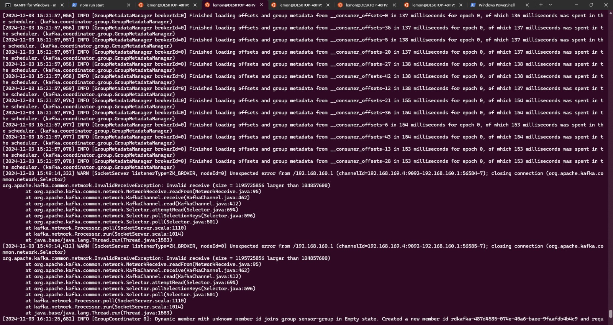
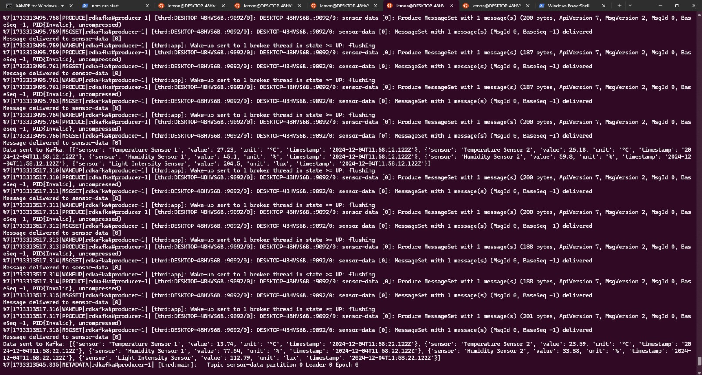
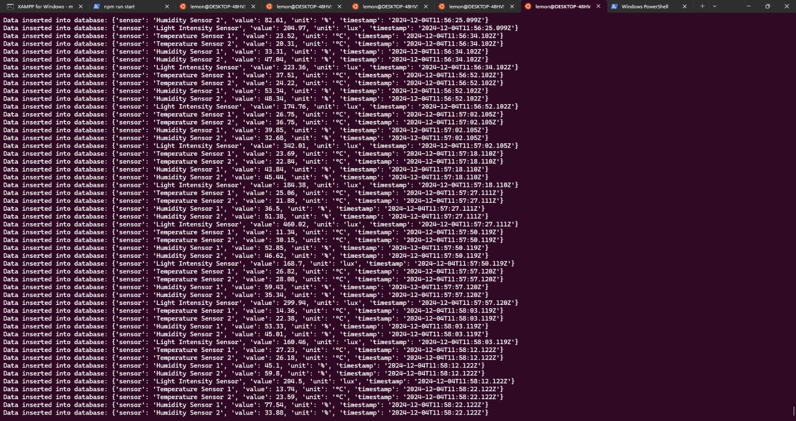

# BigData – Web Scraping, Data Processing, and Streaming Pipeline

## Overview

This project implements a complete data-mining workflow consisting of **web scraping**, **data cleaning**, and a **Kafka-based streaming pipeline**. Cryptocurrency market data is extracted using Selenium, transformed using Pandas, and visualized through a Tableau dashboard. The project demonstrates practical automation, data engineering, and exploratory data analysis skills.

---

## Project Objectives

* Extract structured cryptocurrency data from dynamic web pages.
* Convert raw data into CSV format for analysis.
* Demonstrate message streaming with Kafka (producer–consumer).
* Visualize scraped data with Tableau.

---

## Technologies Used

* **Python 3**
* **Selenium WebDriver**
* **Pandas**
* **Kafka (Producer–Consumer)**
* **Tableau Public**
* **ChromeDriver**

---

## Directory Structure

```
BigData/
├── consumer.py
├── cryptoScraper.py
├── producer.py
├── tocsv.py
└── docs/
    ├── Consumer_application.jpg
    ├── Dashboard 1.png
    ├── kafka.jpg
    ├── producer_application.jpg
    └── zookeeper.jpg
```

---

# 📸 Screenshots

### **Zookeeper Setup**



### **Kafka Server**



### **Kafka Producer Application**



### **Kafka Consumer Application**



### **Tableau Dashboard**


---

## 🔹 1. Web Scraping (`cryptoScraper.py`)

The scraper performs:

* Automated scrolling
* Clicking **Load More** buttons
* Extracting dynamic price and market data with XPath
* Storing results into a structured list (`all_data`)

Data fields collected include:

* Rank
* Name
* Symbol
* Market Cap
* Price
* Circulating Supply
* 24h Volume
* Percent Change (1h / 24h / 7d)

---

## 🔹 2. Data Processing (`tocsv.py`)

Uses Pandas to convert the scraped data into a clean CSV file:

```python
df = pd.DataFrame(data=all_data)
df.to_csv(output_csv, index=False)
```

This CSV is later used for visualization.

---

## 🔹 3. Kafka Streaming Demo

### Producer

`producer.py` sends messages to a Kafka topic.

### Consumer

`consumer.py` listens and processes messages.

This demonstrates a basic real-time data stream pipeline.

---

## 🔹 4. Visualization (Tableau)

The generated CSV is uploaded to Tableau Public.
Interactive charts are arranged into a dashboard:


---

## How to Run the Scraper

### Install dependencies

```bash
pip install selenium pandas
```

### Run

```bash
python cryptoScraper.py -u <target_url> -o output.csv
```

Example:

```bash
python cryptoScraper.py -u https://coinmarketcap.com/ -o crypto.csv
```

---

## How to Run Kafka Demo

Start Kafka & Zookeeper first.

### Producer:

```bash
python producer.py
```

### Consumer:

```bash
python consumer.py
```

---

## Summary

This project demonstrates an end-to-end data workflow:

* Automated web scraping
* Data transformation
* Real-time streaming pipeline
* Visual analytics

It highlights practical experience across automation, scripting, and big-data tooling.
